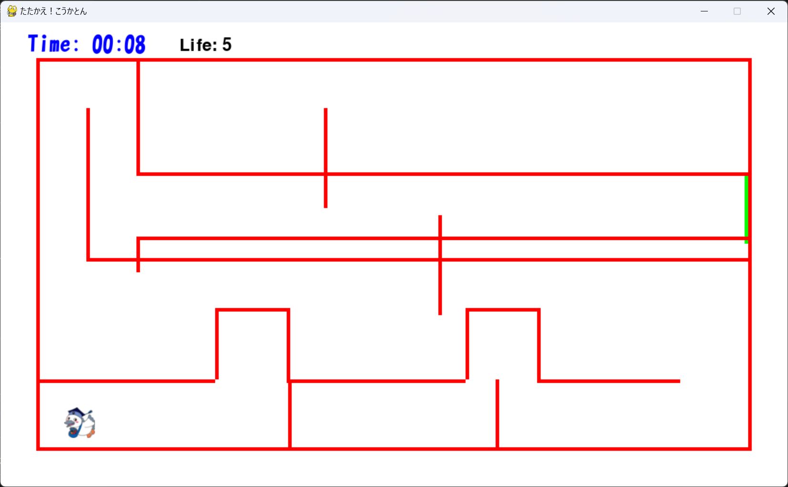

# すすめ！こうかとん、やっぱりもどれ！

## 実行環境の必要条件

- python >= 3.10
- pygame >= 2.1

## ゲームの概要

- 主人公キャラクターこうかとんを操作し、壁や爆弾にぶつからないようにクリアする。
- 複数のステージが用意されており、難易度が徐々に上がる。
- プレイヤーにはライフが設定されており、壁やボムに接触するとライフが減少し、一定時間無敵を付与する。

## ゲームの遊び方

- 矢印キーでこうかとんを操作する。
- ライフが 0 になるとゲームオーバーとなる。
- 各ステージにある緑色の部分がゴール、次のステージに進むことができる。
- ステージクリア時にライフが１つ回復する。

## ゲームの実装

### 共通基本機能

- 背景画像と主人公キャラクターの描画

### 分担追加機能

- 壁を生成　役割：早川　航
- 障害物（壁みたいなもの）役割：佐藤　光暉
- 障害物（ボムみたいなもの）役割：坂本　直輝
- ステージ機能（複数のステージ、難易度の調整）　役割：大橋　諒平
- ライフ機能（ライフの表示、減少機能）　役割：大橋　諒平
- タイム　役割：小澤　虎ノ介

### ToDo

- [ ] ゲームオーバー時の処理の最適化
- [ ] 各ステージのデザイン調整
- [ ] 操作説明
- [ ] 障害物の種類を追加
- [ ] クリア画面に合計タイムと残りライフを表示する

### メモ
- Birdクラス：こうかとんの動作や状態を管理。無敵状態の実装あり。
- Stageクラス：複数のステージを管理し、壁やゴールの配置を制御。
- HEARTクラス：プレイヤーのライフを管理・表示。
- 壁との衝突時にはライフが減少し、一時的な無敵状態になる。
- グリッド表示機能：開発時にステージデザインの補助として使用可能。

## 壁　役割：早川　航
- 触るな危険、こうかとんを丸焼きにします。
- 動かないからイージ?いや、そんなことないはず...。

## ステージとライフシステム（大橋）

- ステージ：

  - 全 3 ステージで構成されています。
  - 各ステージには独自の壁の配置があり、難易度が徐々に上がります。
  - ステージクリア条件：緑色のゴールに到達すること。

- ライフシステム：
  - プレイヤーは初期状態で 5 ライフを持っています。
  - 壁かボムに接触するとライフが 1 減少します。
  - ライフがゼロになるとゲームオーバーです。
  - ゴールすると、ライフが１つ回復します。

## 障害物（ボムみたいなもの）役割：坂本　直輝
- 指定した位置からランダムな方向にボムを発射
- 経過で指定個数まで増える、画面の端かこうかとんに触れた場合、消える。

## 障害物（壁みたいなもの）役割：佐藤　光暉
- 動く範囲,速度などを設定すると指定通りに往復する壁
- こうかとんが触れても消えず、動いたままである。(まるで通行人のようだ)

## タイム　役割：小澤　虎ノ介
- ゲーム開始から時間を計る。
- ゲームオーバーもしくはゲームクリアまでリセットしない。
